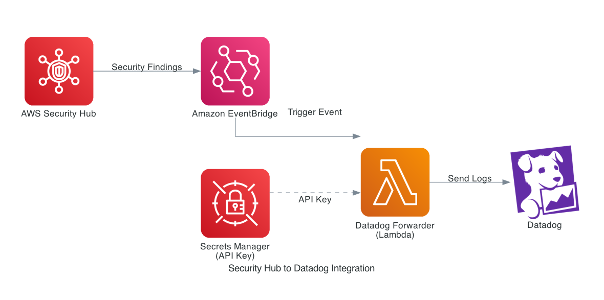

# AWS Security Hub to Datadog Integration

AWS Security Hub의 보안 검색 결과를 Datadog으로 자동 전송하는 Terraform 자동화 프로젝트입니다.

## 📋 목차

- [개요](#개요)
- [아키텍처](#아키텍처)
- [주요 기능](#주요-기능)
- [사전 요구사항](#사전-요구사항)
- [설치 방법](#설치-방법)
- [사용 방법](#사용-방법)
- [리소스 설명](#리소스-설명)
- [참고 자료](#참고-자료)

## 개요

AWS Security Hub는 AWS 환경의 보안 상태에 대한 종합적인 뷰를 제공하며, 업계의 보안 표준과 모범 사례를 기반으로 환경을 점검합니다. 이 프로젝트는 Security Hub에서 발견된 보안 검색 결과(Findings)를 Datadog으로 자동으로 전송하여 중앙화된 모니터링과 알림을 가능하게 합니다.

### 통합의 장점

- **통합 모니터링**: AWS 보안 이벤트를 Datadog의 단일 대시보드에서 확인
- **실시간 알림**: Security Hub 검색 결과를 실시간으로 Datadog에 전송
- **자동화**: EventBridge와 Lambda를 통한 완전 자동화된 로그 전송
- **보안 강화**: Secrets Manager를 통한 API 키의 안전한 관리

## 아키텍처



*이 아키텍처 다이어그램은 [Diagrams](https://diagrams.mingrammer.com/)를 사용하여 코드로 생성되었습니다.*

### 데이터 흐름

1. **AWS Security Hub**: 보안 검색 결과(Findings) 생성
2. **Amazon EventBridge**: Security Hub 이벤트를 감지하고 필터링
3. **Lambda (Datadog Forwarder)**: 이벤트를 수신하여 Datadog 형식으로 변환
4. **Secrets Manager**: Datadog API 키를 안전하게 저장 및 제공
5. **Datadog**: 로그 수신 및 시각화

## 주요 기능

### 자동화된 리소스

이 Terraform 코드는 다음 AWS 리소스를 자동으로 생성하고 구성합니다:

1. **AWS Secrets Manager**
   - Datadog API 키를 안전하게 저장
   - Lambda 함수에서 런타임에 접근

2. **Datadog Forwarder Lambda**
   - CloudFormation을 통한 공식 Datadog Forwarder 배포
   - Security Hub 이벤트를 Datadog 로그로 변환
   - 자동 재시도 및 에러 핸들링

3. **Amazon EventBridge 규칙**
   - Security Hub의 "Findings - Imported" 이벤트 감지
   - 실시간 이벤트 필터링 및 라우팅

4. **IAM 권한**
   - Lambda 실행 권한
   - EventBridge의 Lambda 호출 권한
   - Secrets Manager 읽기 권한

## 사전 요구사항

### 필수 요구사항

- **Terraform**: v1.0 이상
- **AWS CLI**: 구성 및 인증 완료
- **AWS 계정**: Security Hub 활성화 필요
- **Datadog 계정**: API 키 발급 필요

### AWS 권한

Terraform을 실행하는 IAM 사용자/역할은 다음 권한이 필요합니다:

- `secretsmanager:*`
- `cloudformation:*`
- `lambda:*`
- `events:*`
- `iam:*`

## 설치 방법

### 1. 저장소 클론

```bash
git clone https://github.com/jys705/securityhub-to-datadog.git
cd securityhub-to-datadog
```

### 2. Datadog API 키 발급

1. [Datadog Organization Settings](https://app.datadoghq.com/organization-settings/api-keys)에 접속
2. "New Key" 버튼을 클릭하여 새 API 키 생성
3. 생성된 API 키를 안전한 곳에 복사

### 3. 환경 변수 설정

```bash
# terraform.tfvars.example을 복사
cp terraform.tfvars.example terraform.tfvars

# terraform.tfvars 파일 편집
# datadog_api_key에 발급받은 API 키 입력
```

`terraform.tfvars` 예시:

```hcl
datadog_api_key = "your_actual_datadog_api_key_here"
datadog_site    = "datadoghq.com"  # EU의 경우 datadoghq.eu
aws_region      = "ap-northeast-2"  # Seoul region
```

### 4. AWS Security Hub 활성화

Security Hub가 활성화되지 않은 경우:

```bash
aws securityhub enable-security-hub --region ap-northeast-2
```

## 사용 방법

### Terraform 초기화

```bash
terraform init
```

### 실행 계획 확인

```bash
terraform plan
```

### 리소스 배포

```bash
terraform apply
```

배포 확인 메시지가 표시되면 `yes`를 입력합니다.

### 배포 결과 확인

배포가 완료되면 다음 정보가 출력됩니다:

```
Outputs:

forwarder_arn = "arn:aws:lambda:ap-northeast-2:123456789012:function:datadog-forwarder"
eventbridge_rule_arn = "arn:aws:events:ap-northeast-2:123456789012:rule/security-hub-to-datadog"
secret_arn = "arn:aws:secretsmanager:ap-northeast-2:123456789012:secret:datadog_api_key-AbCdEf"
```

### 통합 검증

1. **AWS Console 확인**
   ```bash
   # EventBridge 규칙 확인
   aws events describe-rule --name security-hub-to-datadog
   
   # Lambda 함수 확인
   aws lambda get-function --function-name datadog-forwarder
   ```

2. **Datadog에서 로그 확인**
   - [Datadog Log Explorer](https://app.datadoghq.com/logs)에 접속
   - 검색 필터: `source:aws.securityhub`
   - Security Hub 검색 결과가 로그로 표시되는지 확인

3. **테스트 이벤트 발생**
   - Security Hub에서 샘플 검색 결과 생성
   - 수분 내에 Datadog에 로그가 나타나는지 확인

### 리소스 삭제

더 이상 필요하지 않은 경우 모든 리소스를 삭제할 수 있습니다:

```bash
terraform destroy
```

**주의**: 이 명령은 생성된 모든 AWS 리소스를 영구적으로 삭제합니다.

## 리소스 설명

### AWS Secrets Manager Secret

- **이름**: `datadog_api_key`
- **용도**: Datadog API 키를 암호화하여 저장
- **접근**: Lambda 함수만 읽기 권한 보유

### Datadog Forwarder Lambda

- **함수 이름**: `datadog-forwarder`
- **런타임**: Python 3.11
- **소스**: [Datadog 공식 CloudFormation 템플릿](https://github.com/DataDog/datadog-serverless-functions/tree/master/aws/logs_monitoring)
- **역할**: Security Hub 이벤트를 Datadog API로 전송

### EventBridge 규칙

- **이름**: `security-hub-to-datadog`
- **이벤트 패턴**:
  ```json
  {
    "source": ["aws.securityhub"],
    "detail-type": ["Security Hub Findings - Imported"]
  }
  ```
- **타겟**: Datadog Forwarder Lambda

## 트러블슈팅

### 로그가 Datadog에 나타나지 않는 경우

1. **Lambda 로그 확인**
   ```bash
   aws logs tail /aws/lambda/datadog-forwarder --follow
   ```

2. **EventBridge 규칙 확인**
   ```bash
   aws events list-rule-names-by-target --target-arn <LAMBDA_ARN>
   ```

3. **Datadog API 키 확인**
   - Secrets Manager에서 올바른 API 키가 저장되어 있는지 확인
   - Datadog Organization Settings에서 API 키가 활성화되어 있는지 확인

### Lambda 함수 에러

Lambda 함수 에러 발생 시 CloudWatch Logs를 확인:

```bash
aws logs filter-log-events \
  --log-group-name /aws/lambda/datadog-forwarder \
  --filter-pattern "ERROR"
```

### Security Hub 미활성화

Security Hub가 활성화되지 않은 경우:

```bash
aws securityhub enable-security-hub --region <YOUR_REGION>
```

## 비용 안내

이 솔루션의 예상 AWS 비용:

- **Lambda**: 무료 티어 포함 (월 100만 요청)
- **EventBridge**: 무료 티어 포함 (월 1,400만 이벤트)
- **Secrets Manager**: $0.40/월 (시크릿 1개)
- **CloudWatch Logs**: 데이터 전송량에 따라 변동

대부분의 사용 사례에서 월 $1 미만의 비용이 예상됩니다.

## 보안 고려사항

- ✅ API 키는 Secrets Manager에 암호화되어 저장
- ✅ Lambda 함수는 최소 권한 원칙(Least Privilege) 적용
- ✅ `terraform.tfvars`는 `.gitignore`에 포함되어 버전 관리에서 제외
- ✅ 모든 통신은 HTTPS를 통해 암호화

## 참고 자료

### 공식 문서

- [Datadog AWS Security Hub 통합 가이드](https://docs.datadoghq.com/ko/integrations/amazon_security_hub/)
- [Datadog Forwarder 설정 가이드](https://docs.datadoghq.com/ko/logs/guide/forwarder/?tab=cloudformation)
- [AWS Security Hub 공식 문서](https://docs.aws.amazon.com/securityhub/)
- [AWS EventBridge 문서](https://docs.aws.amazon.com/eventbridge/)

### 추가 리소스

- [Datadog GitHub - Serverless Functions](https://github.com/DataDog/datadog-serverless-functions)
- [Terraform AWS Provider 문서](https://registry.terraform.io/providers/hashicorp/aws/latest/docs)

## 라이선스

MIT License

## 기여

이슈 및 Pull Request를 환영합니다!

## 문의

프로젝트 관련 문의사항은 GitHub Issues를 통해 남겨주세요.

---

**Made with ❤️ for Cloud Security**
